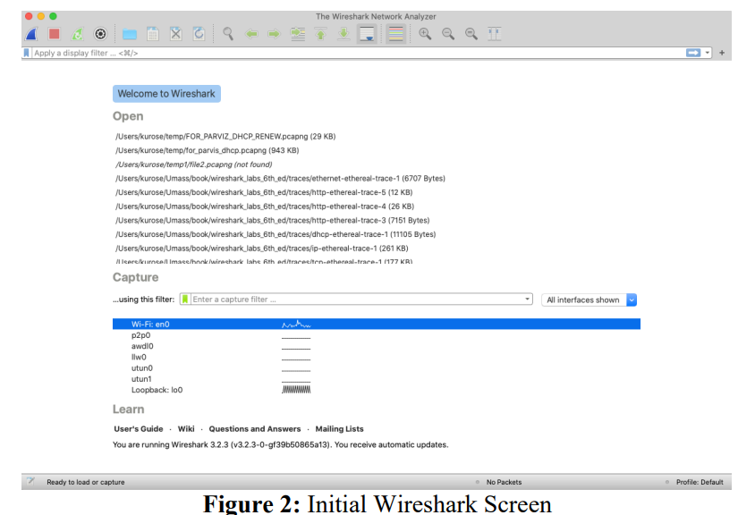
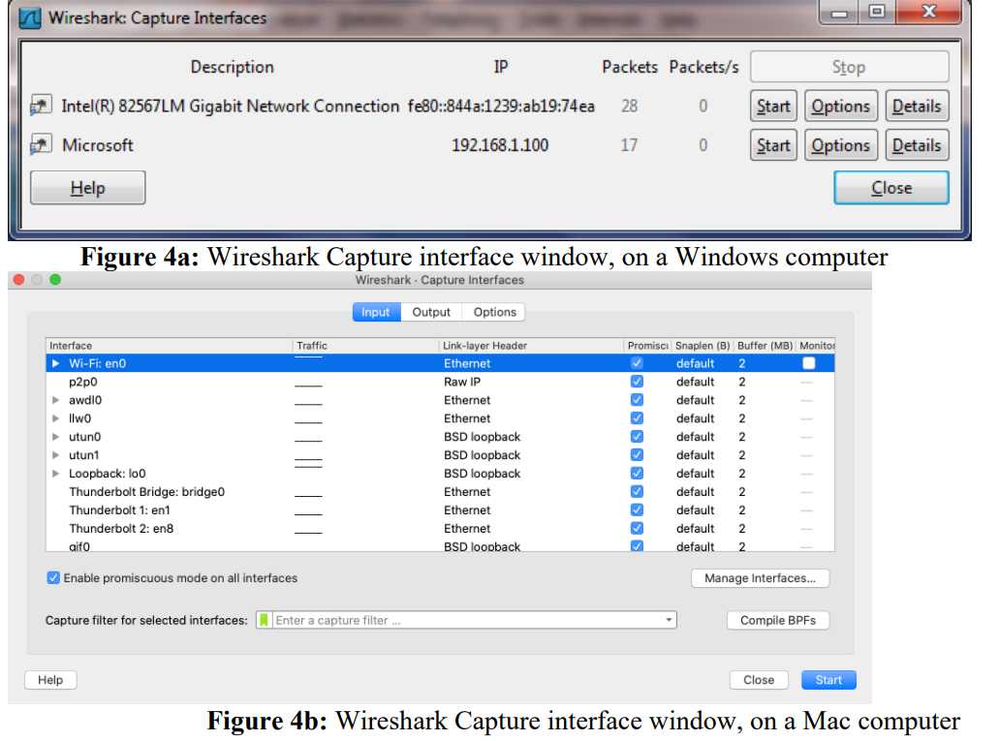
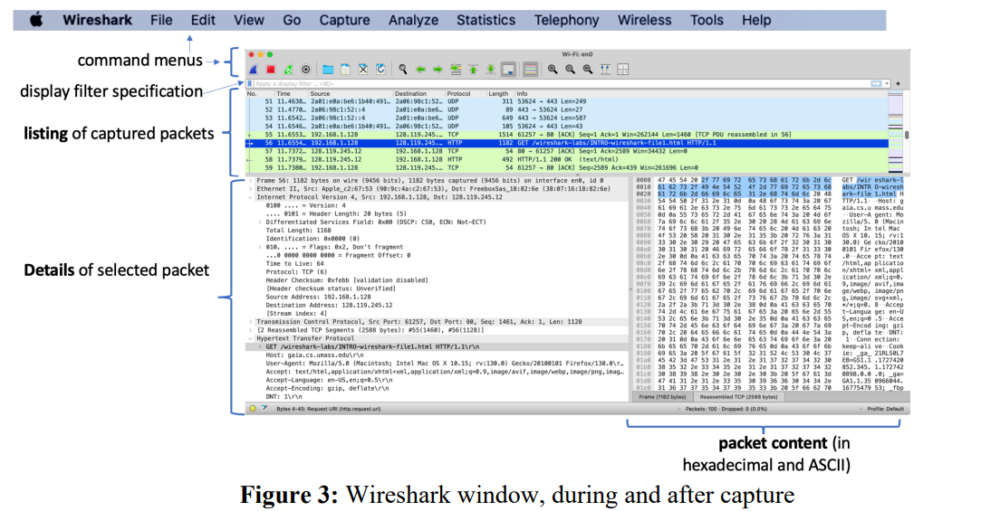
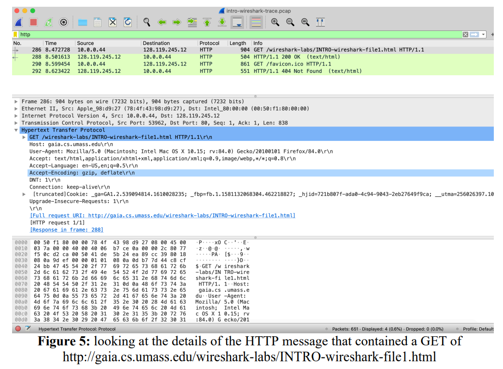

# 🎯 Colocando o Wireshark em Funcionamento (Taking Wireshark for a Test Run)

**Importante** -  Laborátorio adaptado do matérial disponibilizado por Kurouse em: https://gaia.cs.umass.edu/kurose_ross/wireshark.php 

Pré Requesito:
**Ter o Wireshark instalado e funcionando na sua máquina**

A melhor maneira de aprender sobre uma nova ferramenta de software é testando! Vamos assumir que seu computador está conectado à Internet por uma interface Ethernet (com fio) ou Wi-Fi (802.11). Siga os passos abaixo:

1. **Abra seu navegador web favorito**, que exibirá sua página inicial padrão.

2. **Inicie o Wireshark.** Inicialmente, será exibida uma janela semelhante à da . O Wireshark ainda não estará capturando pacotes.

3. Para começar a captura de pacotes:
   - Vá até o menu **Capture** e selecione **Interfaces** (em PCs), ou **Options** (em Macs).
   - Isso abrirá a janela **Wireshark: Capture Interfaces**, onde você verá uma lista de interfaces de rede (como nas ).

4. Você verá uma lista de interfaces disponíveis no seu computador, junto com a contagem de pacotes já observados em cada uma.
   - Em um computador com Windows, clique em **Start** para a interface que deseja usar (por exemplo, "Gigabit Network Connection").
   - O Wireshark agora começará a capturar todos os pacotes sendo enviados e recebidos pela sua máquina!

5. Após iniciar a captura, uma janela semelhante à  aparecerá, mostrando os pacotes capturados.
   - **Não pare a captura ainda.**
   - Vamos gerar tráfego interessante primeiro, usando um navegador que fará requisições HTTP — protocolo que estudaremos em detalhes na disciplina.

6. Com o Wireshark em execução, acesse a seguinte URL no seu navegador:  
   [http://gaia.cs.umass.edu/wireshark-labs/INTRO-wireshark-file1.html](http://gaia.cs.umass.edu/wireshark-labs/INTRO-wireshark-file1.html)  
   Seu navegador se conectará ao servidor HTTP em `gaia.cs.umass.edu`, trocando mensagens HTTP para baixar a página. Essas mensagens, junto com outros quadros de rede, serão capturados pelo Wireshark.

7. Quando a página carregar (é apenas uma linha de parabéns), **interrompa a captura** clicando em **Stop** no Wireshark. A janela principal agora deverá exibir todos os pacotes capturados durante o processo.

   - Entre eles, estarão os pacotes HTTP trocados com o servidor da UMass.
   - Também aparecerão vários outros protocolos — muitos deles operando em segundo plano sem o conhecimento do usuário.
   - Veremos mais sobre esses protocolos ao longo da disciplina.

8. No campo de filtro de exibição no topo da janela do Wireshark, digite `http` (em minúsculo) e pressione **Enter**.  
   - Isso filtrará e exibirá **apenas os pacotes HTTP** na lista.
   -  mostra um exemplo de visualização filtrada, detalhando uma mensagem HTTP GET encapsulada dentro de um segmento TCP, que está em um datagrama IP, dentro de um quadro Ethernet/Wi-Fi.

9. Localize a mensagem **HTTP GET** enviada do seu computador para `gaia.cs.umass.edu`.  
   - Clique nela e expanda as seções de protocolo (usando os ícones ▶/▼).
   - **Minimize as informações dos protocolos Frame, Ethernet, IP e TCP**, e **maximize os detalhes do protocolo HTTP**.

10. **Encerre o Wireshark.**  
    Parabéns! Você completou o primeiro laboratório com captura real de pacotes 🎉

    **INSTRUÇÕES IMPORTANTES**
    O arquivo .pcapng deve ser guardado para depois ser submetido no classroom.

    **Atenção - Responda as questões sobre este laboratório**
    

