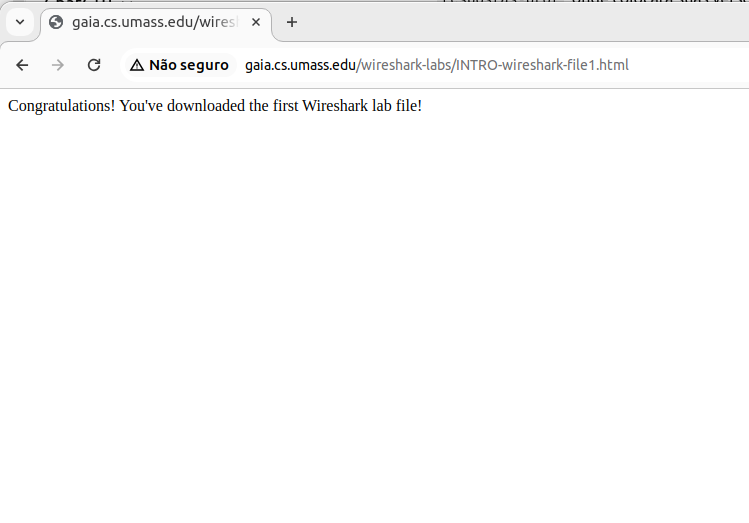

# Exercício 01 - Resolução - Professora Déborah Job 

Esta pasta contém as resoluções comentadas dos exercícios, para serem consultadas **após a tentativa dos alunos**.

Não utilize este material antes de concluir sua própria solução.

Abri o navegador e digitei o endereço: http://gaia.cs.umass.edu/wireshark-labs/INTRO-wireshark-file1.html

Iniciei o wireshark via terminal no linux, em seguida cliquei no botão "start capturing packets".

No navegador cliquei em enter e recebi como resposta a página com a mensagem de "Congratulations! You've downloaded the first Wireshark lab file!" conforme a  

Retornei ao wireskark e apertei o botão stop para parar a captura dos pacotes. E por fim obtive uma saída como a .

Fui em salvar, e escoli o nome captura.pcapng para guardar o arquivo da captura.

Por fim, esse arquivo será submetido no classroom da disciplina.
