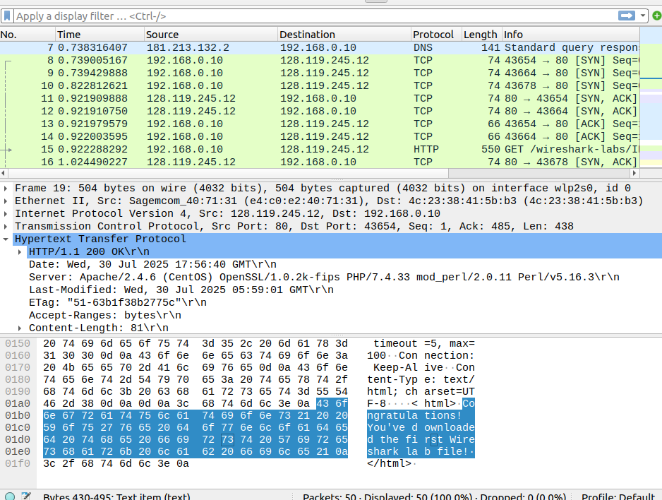

# Exercício 01 - Resolução - Professora Déborah Job 

**IMPORTANTE**
Esta pasta contém as resoluções comentadas dos exercícios, para serem consultadas **após a tentativa dos alunos**.

Não utilize este material antes de concluir sua própria solução.

1. Abri o navegador e digitei o endereço: http://gaia.cs.umass.edu/wireshark-labs/INTRO-wireshark-file1.html

2. Iniciei o wireshark via terminal no linux, em seguida cliquei no botão "start capturing packets".

3. No navegador cliquei em enter e recebi como resposta a página com a mensagem de "Congratulations! You've downloaded the first Wireshark lab file!" conforme a

 

4. Retornei ao wireskark e apertei o botão stop para parar a captura dos pacotes. E por fim obtive uma saída como a

.

5. Fui em salvar, de o nome "captura.pcapng" para o arquivo de captura dos pacotes.

6. Por fim, o arquivo "captura.pcapng" será utilizado para compor o relatório da final dos laboratórios.
